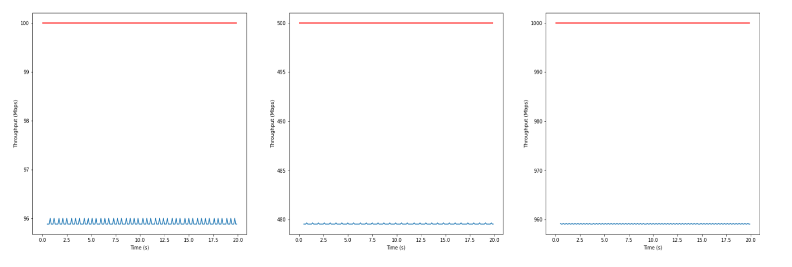
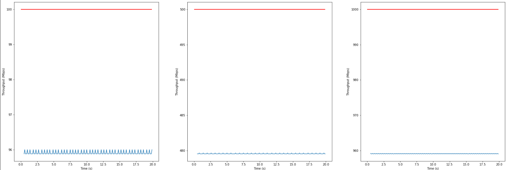
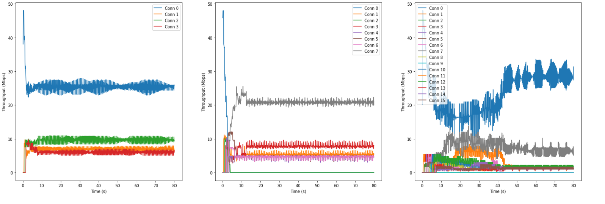
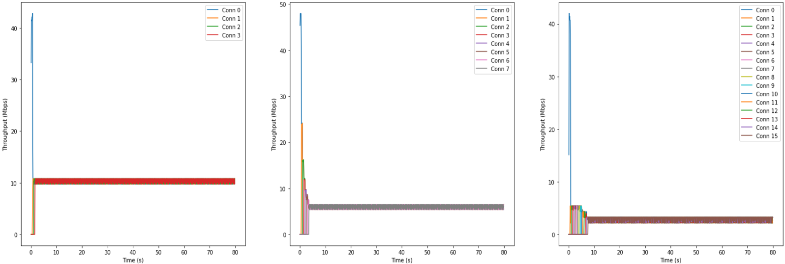
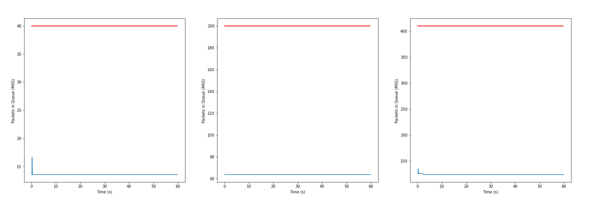
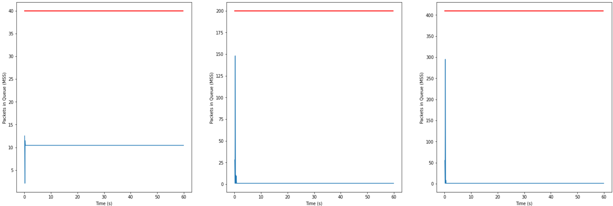

# Congestion Control Swift like algorithm

## Introduction

This project aims to implement a congestion control algorithm similar to Swift in HTSim. The Swift algorithm is a method, developed by Google in 2020, that aims to improve the performance of connections in data centers. It is designed to optimize data transmission in high-bandwidth, low-latency networks. It adjusts the sending rate based on network conditions to minimize latency while maximizing throughput. Swift uses precise, real-time measurements of network congestion to make fine-grained adjustments, avoiding drastic rate changes. By focusing on low-latency, high-speed data transfer, it improves user experience in modern internet environments.

The implementation presented here is built on top of the newReno congestion control algorithm and used in a faculty competition at Politehnica University of Bucharest. The goal of the competition is to implement an algorithm, chosen from a list of options, that excels in three specific scenarios : throughput at different latencies, fairness in a multi-flow scenario and latency under congestion. Using the Swift algorithm as a base, we succeded in obtaining a score of 823 out of 900, ranking *3rd* in the competition.

## Table of contents

- [Introduction](#introduction)
- [Installation](#installation)
- [Implementation](#implementation)
- [References & Credits](#references--credits)

## Installation

This project is powered by HTSim. For more information about HTSim check the
[wiki](https://github.com/nets-cs-pub-ro/NDP/wiki).

This is the recommended way to run the project. You will need [jupyer lab](https://jupyter.org/install) on you pc.

```bash
sudo apt install python3-pip
pip3 install jupyterlab
```

To run the notebook:

```bash
jupyter lab
# This will open a tab in your browser, open the Project_CongestionControl.ipynb notebook from there
```

## Implementation

It utilizes an *Additive Increase, Multiplicative Decrease (AIMD)* strategy to adjust the *congestion window (CWND)* size based on network feedback. The algorithm responds to *acknowledgments (ACKs)* by incrementally increasing the CWND, allowing more packets to be sent. Conversely, it reacts to *negative acknowledgments (NACKs)* or other signs of network congestion by reducing the CWND, aiming to relieve congestion. The implementation is also designed to reduce congestion through a combination of delayed feedback processing and dynamic scaling, where the congestion window is adjusted based on real-time measurements of the *round-trip time (RTT)* and packet acknowledgments.

### Processing a NACK (Negative Acknowledgment)
When the size of the queue is exceeded and a packet is dropped, a NACK is processed. The window is reduced to prevent further congestion. A retransmission is triggered, and the algorithm ensures that the CWND stays within its lower bound.

```cpp
void CCSrc::processNack(const CCNack& nack){    
    _nacks_received++;    
    _flightsize -= _mss; // Reduce the flight size

    _can_decrease = (eventlist().now() - _t_last_decrease) >= rtt;
    
    // Increment retransmit count, reset CWND if threshold reached
    _retransmit_count++;
    if (_retransmit_count >= RETX_RESET_THRESHOLD) {
        _cwnd = _min_cwnd;
    } else {
        if (_can_decrease) {
            _cwnd = (1 - _max_mdf) * _cwnd;  // Multiplicative decrease
        }
    }

    // Clamp to ensure CWND is within bounds
    _cwnd = clamp(_min_cwnd, _cwnd, _max_cwnd);

    // Update last decrease time if needed
    if (_cwnd <= _cwnd_prev) {
        _t_last_decrease = eventlist().now();
    }

    _cwnd_prev = _cwnd;  // Save current CWND
}
```

### Processing an ACK (Acknowledgment)
When an ACK is received, the CWND is adjusted based on the delay and the receipt of the ACK. The algorithm uses additive increase for growth, with the possibility of multiplicative decrease if the network experiences congestion or delay exceeds the target.

```cpp
void CCSrc::processAck(const CCAck& ack) {
    _acks_received++;
    _flightsize -= _mss;  // Adjust flight size
    
    // Calculate round-trip time (RTT) based on the delay
    double delay = timeAsMs(eventlist().now()) - timeAsMs(ack.ts());
    simtime_picosec rtt = delay * 2;

    // Handle duplicate ACKs for fast recovery
    if (_cwnd/_mss == _last_ack_no) {
        _duplicate_ack++;
    } else {
        _duplicate_ack = 0;
        _last_ack_no = _cwnd/_mss;
    }

    if (_duplicate_ack >= 3) {
        // Fast Recovery
        _retransmit_count = 0;
        if (_can_decrease) {
            _cwnd = (1 - _max_mdf) * _cwnd;
        }
    } else {
        // Regular ACK processing, apply Additive Increase
        _retransmit_count = 0;

        if (delay < _target_delay || !ack.is_ecn_marked()) {
            // Additive increase of CWND
            if (_cwnd >= 1 * _mss) {
                _cwnd += (_ai * _mss *_mss/ _cwnd) * _acks_received;
            } else {
                _cwnd += _ai * _acks_received * _mss;
            }
        } else {
            // Delay exceeded target, apply multiplicative decrease
            if (_can_decrease) {
                double a = 1 - _betta * ((delay - _target_delay) / delay);
                double b = 1 - _max_mdf;
                _cwnd = max(a, b) * _cwnd;
            }
        }
    }

    // Clamp to enforce lower/upper CWND bounds
    _cwnd = clamp(_min_cwnd, _cwnd, _max_cwnd);

    // Update time of last decrease
    if (_cwnd <= _cwnd_prev) {
        _t_last_decrease = eventlist().now();
    }

    _cwnd_prev = _cwnd;  // Save previous CWND value
    _can_decrease = (eventlist().now() - _t_last_decrease) >= rtt;
}
```

## Reno vs Swift

### Throughput at different latencies

newReno            |  Swift
:-------------------------:|:-------------------------:
  |  

- We can observe that the Swift algorithm has quite the same thoughput as the newReno algorithm, because both methods are based on the AIMD strategy.

### Fairness in a multi-flow scenario

newReno            |  Swift
:-------------------------:|:-------------------------:
  |  

- In a multi-flow scenario, newReno fails to maintain fairness between connections, some users are experiencing a much lower throughput than others. On the other hand, Swift maintains a more balanced throughput across all connections.

### Latency under congestion

newReno            |  Swift
:-------------------------:|:-------------------------:
  |  

- The Swift algorithm is able to maintain a lower latency under congestion compared to newReno. This is due to the fine-grained adjustments made by Swift to the congestion window, allowing it to respond more quickly to network conditions.

## References & Credits

* This project was developed by [Victor](https://github.com/Viktor09), [Robert](https://github.com/robertpaulp), [Alexandru](https://github.com/alexandrutrifu) and [Rares](https://github.com/rrsmart8).

* The resources used:
    * https://2022-cs244.github.io/papers/L5-swift.pdf
    * https://github.com/ani2796/swift-start-ns3/blob/master/tcp-swiftstart.cc
    * https://github.com/rsburke4/ns3-swift/blob/master/ns3/src/internet/model/tcp-swift.cc#L319